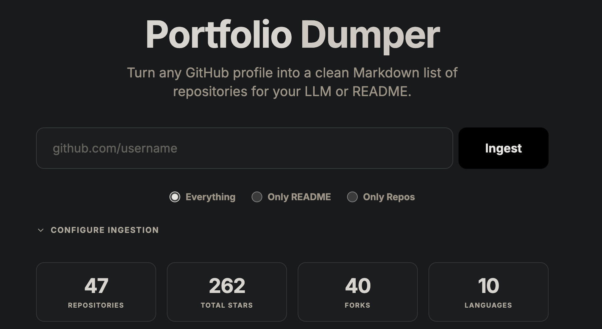

# Portfolio Dumper



Portfolio Dumper is a minimalist static web application designed to convert GitHub profiles and repositories into clean, LLM-friendly Markdown. It allows users to quickly ingest profile READMEs, repository lists, or specific repository metadata for use in documentation, portfolios, or AI prompts.

## Features

- Profile Ingestion: Fetch a user profile README and their list of original repositories.
- Targeted Repository Ingestion: Paste a specific repository URL to fetch its README and metadata directly.
- Flexible Ingestion Modes: Choose between fetching only the README, only the repositories, or both.
- Intelligent Input Parsing: Support for raw usernames, profile URLs, and deep repository links.
- Personal Access Token Support: Option to use a GitHub PAT for higher rate limits and access to private data.
- Statistics Overview: Real-time calculation of repository counts, star counts, forks, and language diversity.
- Export Options: Easy copying to clipboard or downloading as a Markdown file.
- Static and Secure: Runs entirely in the browser using the GitHub REST API.

## Usage

1. Open the application in your browser.
2. Enter a GitHub username or any GitHub URL in the input field.
3. Select your desired ingestion mode (Everything, Only README, or Only Repos).
4. (Optional) Provide a GitHub Personal Access Token in the settings panel to avoid rate limits.
5. Click Ingest to generate the Markdown.
6. Use the Copy or Download buttons to export your result.

## Self-Hosting

### Using Nginx Directly

Since this is a static site, you can serve the index.html file and the assets folder using any web server like Nginx, Apache, or even Python's http.server.

### Using Docker

A pre-built Docker image is available via GitHub Packages (GHCR).

#### Run with Docker

To run the latest version directly:

```bash
docker run -d -p 8080:80 ghcr.io/abduznik/portfolio-dumper:latest
```

#### Using Docker Compose

Create a `docker-compose.yml` file with the following content:

```yaml
services:
  app:
    image: ghcr.io/abduznik/portfolio-dumper:latest
    ports:
      - "8080:80"
    restart: unless-stopped
```

Then start the application:

```bash
docker-compose up -d
```

The application will be available at http://localhost:8080.

## Technical Details

- Frontend: Tailwind CSS via CDN.
- API: GitHub REST API v3.
- Logic: Vanilla JavaScript for all fetching and processing.
- Security: No server-side processing. All tokens are used only within your local browser context.

## License

This project is licensed under the MIT License.
